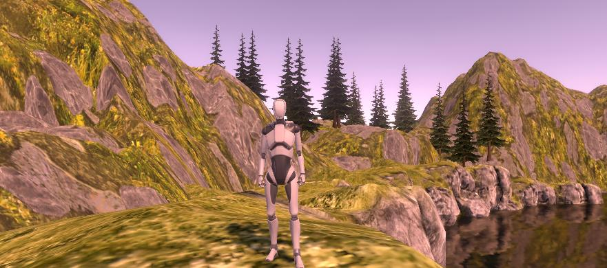

# MTEC2120-FALL2023FIXED
//Homework #1//

//Homework #2//
https://youtu.be/NI_k-hK-f3s
*/ Note: I created the gun for the player and attach it so no matter what direction the gun will always aim where the player is facing. Also created a bullet prefab and made scripts called Gun and bullet respectively. */

//Homework #3//
https://youtu.be/KzB28wKI-9g
*/ Note: Created a balloon using a sphere and cylinder. Then I created a script called BalloonFloat and typed the value in code and the speed to make the balloon float. PopBallon script was made where if the bullet touches the balloon then it would destroy the balloon. */  

//Homework #4//
https://youtu.be/eyK_LxC2_LI

//Homework #5//
https://youtu.be/TTBLZT_wCbw
/* Note: for homework 5 I made a custom input where I assign the F key to activate an animation called 
 dodgebackward on the input binding. Then, I modify both the StarterAssetsInputs and ThirdPersonController scripts to add the input in code. */

 //Homework #6//
https://youtu.be/K4iPGcrh9ZE
/* Note: for homework 6, 2 animations (Dance Robot and Dance HipHop) were used and assigned to keys 2 and 3 respectively. Using the statecontroller script and tweaked the thirdpersoncontroller script to include IDs for both animations. Both are set as triggers so that the player can transition one dance to another by pressing the keys anytime.*/

//Homework #7//
https://youtu.be/OnQVixY1hKs

//Homewwork #8//
https://youtu.be/U5sz-jWxDFU

 
